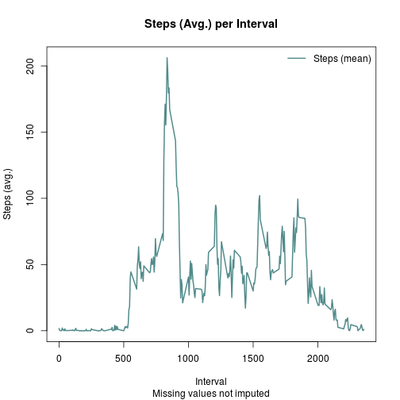
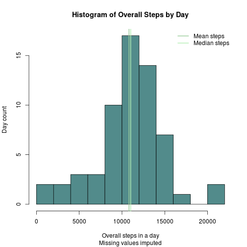
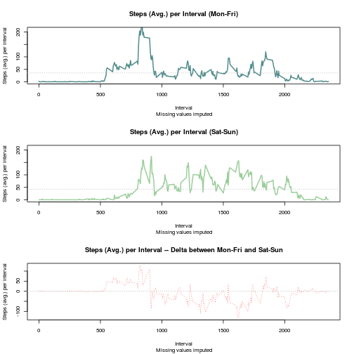

Author:       Simon Dexter, simondex@yahoo.com  
Date:         05/10/15  

Project:      Analysis of Daily Activity Data  
Class:        Reproducible Research, Data Science Specialization  

Data source:  activity.csv  


A. Data processing  

The data is loaded from 'activity.csv' file. The key on the dataset  
is verified (it is date-interval). Steps variable is converted to  
numeric type; interval variable is converted to numeric for proper   
plotting on x-axis. Date variable is not converted until later.


```r
require(data.table);
```

```
## Loading required package: data.table
## data.table 1.9.4  For help type: ?data.table
## *** NB: by=.EACHI is now explicit. See README to restore previous behaviour.
```

```r
require(dplyr);
```

```
## Loading required package: dplyr
## 
## Attaching package: 'dplyr'
## 
## The following objects are masked from 'package:data.table':
## 
##     between, last
## 
## The following object is masked from 'package:stats':
## 
##     filter
## 
## The following objects are masked from 'package:base':
## 
##     intersect, setdiff, setequal, union
```

```r
# Loading and preprocessing the data

d = read.csv(unz('activity.zip', 'activity.csv'), 
             header = T, 
             stringsAsFactors = F,
             colClasses = 'character');


# verifying date-interval is key
d = data.table(d);
s = d[, .N, by=list(interval, date) ];
any(s$N > 1)
```

```
## [1] FALSE
```

```r
d = data.frame(d);


d$steps = as.numeric(d$steps);
d$interval = as.numeric(d$interval);
```


B. What is mean total number of steps taken per day?  

Records with missing values are explicitly discarded, so only records  
with populated step counts are taken into account. The step counts are  
aggregrated (added up) to produce total count of steps by day. Distribution  
of these values is then shown on a histogram. Mean and median values are  
plotted as two separate lines. Since the values (in this case) are so  
close, they appear as one line.  


```r
################################################################################
# What is mean total number of steps taken per day?


# looking only at records with populated counts
d1 = d[!is.na(d$steps), ];
d1 = data.table(d1);
s1 = d1[, list(Steps = sum(steps, na.rm = T) ), 
        by = date];

hist(
    s1$Steps,
    breaks = 10,
    main = 'Histogram of Overall Steps by Day',
    xlab = 'Overall steps in a day',
    ylab = 'Day count',
    col = 'darkslategray4'
    );

abline(v = mean(s1$Steps), col = 'darkseagreen3', lwd = 2, lty = 1);
abline(v = median(s1$Steps), col = 'darkseagreen2', lwd = 2, lty = 1);

legend('topright', legend = c('Mean steps', 'Median steps'), 
                                bty='n',
                                lwd = 2, lty =  1,
                                     col = c('darkseagreen3',
                                             'darkseagreen2') );
```

 

```r
# mean steps per day
mean(s1$Steps);
```

```
## [1] 10766.19
```

```r
# median steps per day
median(s1$Steps);
```

```
## [1] 10765
```


C. What is the average daily activity pattern?  

Mean step count is computed with respect to interval of the day, missing  
values are excluded from the computation explicitly ('na.rm=T' parameter)  
and hence do not affect the computation. 

The interval with highest mean step count is 8:35 am to 8:40 am with  
~ 206 steps.  


```r
################################################################################
# What is the average daily activity pattern?
d = data.table(d);

s2 = d[, list(StepsAvg = mean(steps, na.rm = T) ), by = interval];
s2 = data.frame(s2);

plot(
    s2$StepsAvg ~ s2$interval, 
    type = 'l', 
    col = 'darkslategray4',
    lwd = 2, 
    lty = 1,
    main = 'Steps (Avg.) per Interval',
    xlab = 'Interval',
    ylab = 'Steps (avg.)',
    sub = 'Missing values not imputed');


legend('topright', legend = c('Steps (mean)'), 
                                bty='n',
                                lwd = 2, lty =  1 ,
                                     col = 'darkslategray4');
```

 

```r
# maximum avg steps    
max(s2$StepsAvg)    
```

```
## [1] 206.1698
```

```r
# interval with maximum avg steps is 8:35 - 8:40
s2[ which.max(s2$StepsAvg), ];
```

```
##     interval StepsAvg
## 104      835 206.1698
```

D. Imputing missing values  

Missing values will be populated using mean step count corresponding to  
the daily interval of the missing value and weekday of the missing value.  
For example, if a given record with missing step count corresponds to  
8:35 am on a Monday, the step value will be populated using mean step count   
at 8:35 am across every Monday. The histogram of daily step count using  
imputed step count values is then plotted. Mean and median lines are now  
discernable.


```r
################################################################################
# Imputing missing values


d = data.frame(d);
# how many records have missing step count?
sum(is.na(d$steps));
```

```
## [1] 2304
```

```r
d$date = strptime(d$date, '%Y-%m-%d');
d$WeekDay = weekdays(d$date); 

d$date = as.character(d$date);

# extracting the records with populated step values
d2 = d[!is.na(d$steps), ];
d2 = data.table(d2);

s2 = d2[, list(StepsAvg = mean(steps, na.rm=T)), by = list(interval, WeekDay)];


d = tbl_df(d);
s2 = tbl_df(s2);

d3 = left_join(d, s2, 
               by.x = list('interval','WeekDay'), 
               by.y = list('interval', 'WeekDay') );
```

```
## Joining by: c("interval", "WeekDay")
```

```r
d3 = data.frame(d3);


d3$StepsFilled = ifelse(is.na(d3$steps), d3$StepsAvg, d3$steps);

d3 = data.table(d3);

s3 = d3[, list(StepsFilled = sum(StepsFilled, na.rm=T) ), by=date];

hist(
  s3$StepsFilled,
  breaks = 10,
  main = 'Histogram of Overall Steps by Day',
  xlab = 'Overall steps in a day',
  ylab = 'Day count',
  col = 'darkslategray4',
  sub = 'Missing values imputed');


abline(v = mean(s3$StepsFilled), col = 'darkseagreen3', lwd = 2, lty = 1);
abline(v = median(s3$StepsFilled), col = 'darkseagreen2', lwd = 2, lty = 1);

legend('topright', legend = c('Mean steps', 'Median steps'), 
                                bty='n',
                                lwd = 2, lty =  1,
                                     col = c('darkseagreen3',
                                             'darkseagreen2') );
```

 

```r
# mean steps per day (missing values imputed)
mean(s3$StepsFilled);
```

```
## [1] 10821.21
```

```r
# median steps per day (missing values imputed)
median(s3$StepsFilled);
```

```
## [1] 11015
```


E. Are there differences in activity patterns between weekdays and weekends?  


Every record is classified in two groups: Mon-Fri or Sat-Sun. Mean imputed  
step value is computed with respect to interval and day group. A time series  
plot contains three lines: Mon-Fri mean step counts, Sat-Sun mean step count  
and difference between Mon-Fri and Sat-Sun group.  


```r
################################################################################
# Are there differences in activity patterns between weekdays and weekends?

d3 = data.frame(d3);


d3$WeekDayType = ifelse(d3$WeekDay %in% c('Saturday', 'Sunday'), 
                        'Sat-Sun', 'Mon-Fri');

d3 = data.table(d3);

s4 = d3[, list(StepsAvg = mean(StepsFilled, na.rm = T) ), 
        by = list(WeekDayType, interval)];

s4 = data.frame(s4);

s4.1 = s4[s4$WeekDayType == 'Mon-Fri', ];
s4.2 = s4[s4$WeekDayType == 'Sat-Sun', ];

par(mfrow = c(3, 1));

plot(s4.1$StepsAvg ~ s4.1$interval,  
     main = 'Steps (Avg.) per Interval (Mon-Fri)',
     xlab = 'Interval',
     ylab = 'Steps (avg.) per interval',
     sub = 'Missing values imputed',
     type = 'l', 
     lty = 1, 
     lwd = 2, 
     col = 'darkslategray4',
     ylim = c(0, 210)
);

abline(h=mean(s4.1$StepsAvg) ,lty=3,lwd=1,col='gray');

plot(s4.2$StepsAvg ~ s4.2$interval, 
     main = 'Steps (Avg.) per Interval (Sat-Sun)',
     xlab = 'Interval',
     ylab = 'Steps (avg.) per interval',
     sub = 'Missing values imputed',
     type = 'l', 
     lty = 1, 
     lwd = 2, 
     col = 'darkseagreen3',
     ylim = c(0, 210)
);

abline(h=mean(s4.2$StepsAvg) ,lty=3,lwd=1,col='gray');

s4.1 = tbl_df(s4.1);
s4.2 = tbl_df(s4.2);

s5 = inner_join (s4.1, s4.2, by='interval');

s5$Delta = s5$StepsAvg.x - s5$StepsAvg.y;


plot(s5$Delta ~ s5$interval, 
     main = 'Steps (Avg.) per Interval -- Delta between Mon-Fri and Sat-Sun',
     xlab = 'Interval',
     ylab = 'Steps (avg.) per interval',
     sub = 'Missing values imputed',
     type = 'l', 
     lty = 3, 
     lwd = 0.5, 
     col = 'red'
);

abline(h=0,lty=3,lwd=1,col='gray');
```

 


